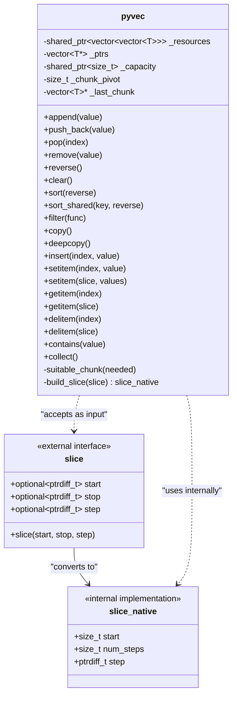

# PyVec Container Documentation

The **pyvec** container is a C++ template class designed to mimic Python list behavior while ensuring that element pointers (references) remain valid even after modifications such as insertions and removals. This is achieved through a segmented storage design and a dedicated pointer array.

---

## Overview

- **Stable References:**  
  Unlike a traditional `std::vector`, where reallocations may invalidate pointers, **pyvec** maintains stability by storing elements in multiple “chunks” (each a `std::vector<T>`) and keeping an auxiliary vector (`_ptrs`) of pointers to each element.

- **Segmented Storage:**  
  Data is stored in chunks managed by a shared resource `_resources`. This design helps in reducing pointer invalidation and improves performance for frequent modifications.

- **Python-Like Interface:**  
  The class provides methods analogous to Python lists, such as:
    - `append`, `extend`
    - `insert`, `pop`, `remove`
    - Slice-based access and modification via `getitem`, `setitem`, `delitem`
    - Other utility functions like `copy`, `deepcopy`, `sort`, and `filter`.

- **Iterator Variants:**  
  Three types of iterators are provided:
    - **iterator / const_iterator:** Standard iterators for traversing the container.
    - **shared_iterator:** Returns shared pointers to elements, ensuring that the underlying resources remain alive during iteration.

---

## Key Components



### Internal Data Structures

- **_resources:**  
  A shared pointer to a vector of chunks (`std::vector<std::vector<T>>`). Each chunk stores a part of the overall data.

- **_ptrs:**  
  A `std::vector<T*>` that holds pointers to each element in the container. This array allows constant-time access and preserves pointer validity.

- **_capacity:**  
  A shared pointer to the total capacity (sum of capacities of all chunks). It aids in managing memory allocation.

- **_chunk_pivot:**  
  An index used to quickly locate the first chunk with available space for new insertions. This accelerates the allocation process in the `suitable_chunk` method.

- **_last_chunk:**  
  A pointer to the most recently used chunk. It provides a fast path for sequential insertions.

### Slice Support

- **slice Structure:**  
  Mimics Python’s `slice` object. It contains optional `start`, `stop`, and `step` values.

- **build_slice Function:**  
  Converts a `slice` into a native representation (`slice_native`) by computing the effective start index, the number of steps (elements), and the step value. This supports both positive and negative steps.

### Iterators

- **iterator & const_iterator:**  
  Provide random access to elements by wrapping a pointer to an element pointer within `_ptrs`.

- **shared_iterator:**  
  In addition to traversing the container, it holds a shared pointer to `_resources` to ensure that the underlying data is not deallocated during iteration.

---

## API Reference

### Constructors & Assignment

- **Default Constructor:**  
  `pyvec()` initializes an empty container.

- **Iterator Constructor:**  
  Allows construction from a range specified by two iterators.

- **Copy Constructor & Assignment:**  
  Performs a deep copy (by copying elements) from another pyvec.

- **Move Constructor & Assignment:**  
  Transfers ownership of resources without copying elements.

- **Initializer List Constructor & Assignment:**  
  Enables initialization using `{ ... }` syntax.

### Element Access

- **at(size_type pos):**  
  Returns the element at the specified position with bounds checking.

- **operator[]:**  
  Provides unchecked element access.

- **front() / back():**  
  Accesses the first and last elements, respectively.

### Modifiers

- **append(value):**  
  Adds an element to the end of the container.

- **insert(index, value):**  
  Inserts an element at the specified index. Supports negative indexing (Python style).

- **erase(iterator pos) / erase(first, last):**  
  Removes element(s) from the container.

- **push_back / pop_back:**  
  Standard methods for adding/removing elements at the end.

- **resize(count[, value]):**  
  Adjusts the container’s size. New elements are default-constructed or initialized with `value`.

- **swap(other):**  
  Exchanges the contents of two pyvec containers.

### Python-Style Methods

- **extend(...):**  
  Appends elements from an iterator range or another pyvec.

- **pop(index):**  
  Removes and returns the element at the given index (default: last element).

- **remove(value):**  
  Removes the first occurrence of a specified value.

- **reverse():**  
  Reverses the order of elements.

- **copy() / deepcopy():**  
  Create shallow or deep copies of the container.

- **setitem / getitem / delitem:**  
  Support for item assignment, retrieval, and deletion using both single indices and slices.

- **contains(value):**  
  Checks whether the container contains a specific value.

### Sorting & Filtering

- **sort([key, reverse]):**  
  Sorts the container. A key function can be provided; setting `reverse` to true sorts in descending order.

- **filter(func):**  
  Removes elements that do not satisfy the predicate function.

### Utility

- **collect():**  
  Returns a contiguous `std::vector<T>` containing all the elements in the container.

---

## Example Usage

```cpp
#include "pyvec.hpp"
#include <iostream>

using namespace pycontainer;

int main() {
    // Create a pyvec with initializer list
    pyvec<int> pv = {1, 2, 3, 4, 5};

    // Append an element
    pv.append(6);

    // Insert an element at index 2
    pv.insert(2, 99);

    // Pop the last element
    auto last_elem = pv.pop();

    // Reverse the container
    pv.reverse();

    // Access element using negative index (Python style)
    auto first_elem = pv.at(0);
    auto last_elem_again = pv.getitem(-1);

    // Check if container contains a value
    if (pv.contains(99)) {
        std::cout << "Contains 99" << std::endl;
    }

    // Collect all elements into a contiguous vector
    std::vector<int> vec = pv.collect();

    return 0;
}
```

---

## Error Handling

- **Out-of-Range Access:**  
  Functions such as `at()` and `pypos()` throw a `std::out_of_range` exception if an invalid index is provided.

- **Invalid Slice:**  
  If a slice with an invalid step (e.g., step equal to zero) is used, an `std::invalid_argument` exception is thrown.

- **Remove/Index Operations:**  
  If an element is not found during `remove()` or `index()` operations, an exception is thrown.

---

## Design Considerations

- **Memory Stability:**  
  By storing elements in separate chunks and maintaining a separate pointer array, **pyvec** ensures that even if internal memory reallocations occur (in a given chunk), the pointers in `_ptrs` remain valid.

- **Performance:**  
  The use of `_chunk_pivot` and `_last_chunk` accelerates the search for available space when inserting new elements.

- **Resource Sharing:**  
  Shallow copies (via `copy()`) share the underlying data, which can be efficient but may require care when modifying shared data.

---

## License

This project is licensed under the MIT License. See the [LICENSE](LICENSE) file for details.
